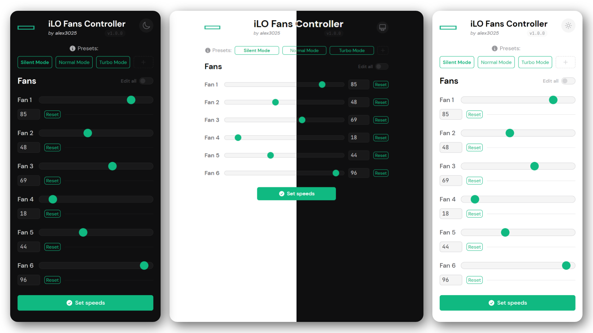

<h1 align="center">iLO Fans Controller</h1>

<p align="center">
  
  <br>
  <i>Easily manage your HP's server fans speeds, anywhere!</i>
</p>

---


> ℹ **NOTE:** The v1.1.0 is a **complete rewrite** of the tool, so any feedback is appreciated!<br>
> If you find any bug or have any suggestion, please [open an issue](https://github.com/breadjs/ilo-fans-controller/issues). Thanks! 😄

## FAQ

## How does it work? 🛠

This tool is a **NodeJS script** that uses the `fetch` to **get the current server fan speeds from the iLO REST api** and the `ssh2` extension to **set the fan speeds using the [patched iLO SSH interface](#can-i-use-this-tool-with-my-hp-server-%EF%B8%8F).** You can also **create custom presets** to set a specific fan configuration with a single click, all with a **simple and clean web interface** made using [Alpine.js](https://alpinejs.dev/) and [TailwindCSS](https://tailwindcss.com/).

## Can I use this tool with my HP server? 🖥️

This tool requires a **patched iLO firmware** that expose to the iLO SSH interface some commands to manipulate the fans speeds. You can find more information about this patch on [this Reddit post](https://www.reddit.com/r/homelab/comments/sx3ldo/hp_ilo4_v277_unlocked_access_to_fan_controls/).

As of now, the patch (and so this tool) only works for **Gen8 & Gen9 servers with iLO 4.**

> Gen10 servers with iLO 5 are not supported at the moment.

## Why NodeJS?

I rewrote this script as it took a very long to get a response back from the SSH client. I will also be adding more things like a fan curve depending on specific temperature points. This requires a backend like NodeJS.

---

## Manual installation

### The following guide was run on

* An **HP DL360p G8** server
* **Patched iLO 4** Advanced **v2.77**
* A Proxmox container (LXC) running **Ubuntu 22.04**
* **NodeJS v18**

### Preparing the environment

1. Update the system:

    ```sh
    sudo apt-get update && sudo apt-get upgrade
    ```

### Downloading the tool

1. Clone the repository:

    ```sh
    git clone https://github.com/breadjs/ilo-fans-controller/
    ```

2. Enter the directory:

    ```sh
    cd ilo-fans-controller
    ```

### Configuring and installing the tool

1. Open the `config.js` file you favourite text editor and change the variables according to your configuration.

    > ℹ **NOTE:** Remember that `SSH_HOSTANME` is the IP address or hostname of your iLO interface, not of the server itself.

    > ℹ **NOTE:** It's recommended to create a new iLO user with the minimum privileges required to access the SSH interface and the REST api (Remote Console Access).

    Here is an example:

    ```js
    module.exports = {
        SSH_HOSTNAME: "192.168.3.1",
        SSH_USERNAME: "Username",
        SSH_PASSWORD: "Password",
        SERVICE_PORT: 80,
        DEBUG: false
    }
    ```

2. When you're done, run the following command to install and run the service.
    ```sh
    npm i
    node .
    ```

3. That's it! Now you can reach the tool at `http://<your-server-ip>/`

> ℹ **NOTE:** If the web server where you installed this tool **will be reachable from outside your network**, remember to **setup some sort of authentication** (like Basic Auth) to prevent _unauthorized fan management at 2AM_.

---

## Troubleshooting

The first thing to do when you encounter a problem is to **check the logs**.

If you think you found a bug, please [open an issue](https://github.com/breadjs/ilo-fans-controller/issues) and I'll take a look.

Below you can find some common problems and their solutions.

### The presets are not saved

This is not yet implemented but will be there again soon.
